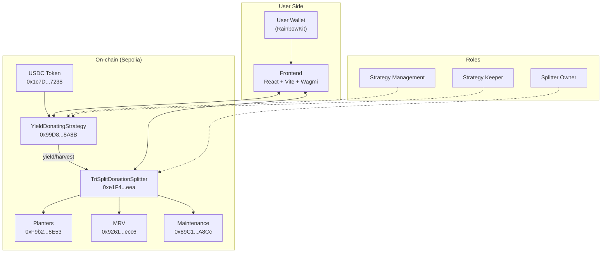

# CanopySplit

Donate your yield, keep your principal. CanopySplit is a DeFi protocol that lets you deposit USDC into a yield-generating strategy and automatically splits the profits among climate impact recipients.

## What it does

- Deposit USDC and earn yield
- Keep 100% of your principal
- All profits go to climate projects (tree planting, monitoring, maintenance)
- Transparent on-chain distribution with customizable splits

## Live on Sepolia

**Contracts**
- Strategy: `0x99D8C89E43AA7Cf4628D6F496Ba749D077f78A8B`
- Splitter: `0xe1F4d6b65e37282D5E1d9e5e9bbd3b0F27683eea`
- USDC: `0x1c7D4B196Cb0C7B01d743Fbc6116a902379C7238`

**Recipients**
- Planters: `0xF9b2eFCAcc1B93c1bd7F898d0a8c4b34aBD78E53`
- MRV: `0x9261432cab3c0F83E86fa6e41E4a88dA06E7ecc6`
- Maintenance: `0x89C13e8e5a81E775160322df9d7869893926A8Cc`

## How it works



## Project structure

- **frontend/** - React app with wallet connection, deposit/withdraw UI, and admin controls
- **smart-contracts/** - Solidity contracts built with Foundry

## Getting started

### Frontend

```bash
cd frontend
npm install
```

Create a `.env` file:
```
VITE_SEPOLIA_RPC_URL=your_rpc_url
VITE_WALLETCONNECT_PROJECT_ID=your_project_id
```

Run the app:
```bash
npm run dev
```

### Smart contracts

```bash
cd smart-contracts
forge build
forge test
```

For deployment, copy `.env.example` to `.env` and add your private key and RPC URL.

## Features

**For users:**
- Deposit and withdraw USDC anytime
- Track your balance and total yield donated
- See real-time distribution to recipients

**For admins:**
- Report yield and trigger distributions (Management/Keeper roles)
- Adjust recipient splits for future epochs (Owner role)
- Simulate profit for testing (Management only)

## License

MIT
